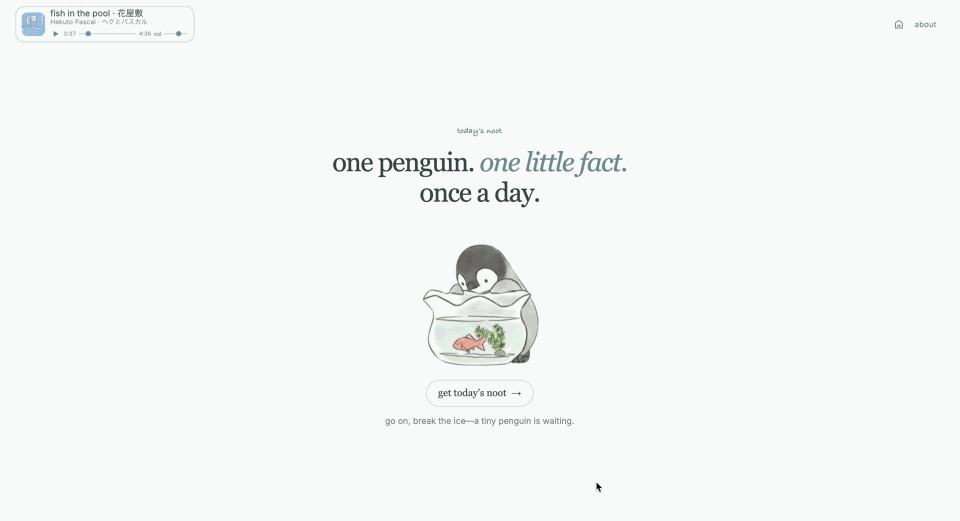

# Noot of the Day

One penguin. One little fact. Once a day.

## Preview



## About

Noot of the Day is a small daily penguin ritual. Reveal one sourced fact beside
a rotating storybook illustration, then come back after local midnight for the
next one. There are no accounts, streaks, feeds, or endless shuffle controls.

Every reveal follows the same quiet composition: the date, one transparent
penguin illustration, “Did you know…” on its own line, and the day's fact.

## How the daily Noot works

1. The app creates a `YYYY-MM-DD` key from the visitor's local calendar date.
2. A Noot already stored for that date is restored immediately.
3. Otherwise, the app requests a fact through its same-origin `/api/noot`
   adapter. A valid upstream response is normalized and stored.
4. If the upstream is unavailable or malformed, the app uses its local
   30-fact fallback collection. The facts follow a stable shuffled cycle, so
   every fact appears once before the sequence repeats on day 31.
5. Artwork is selected independently from the transparent illustrations in
   `public/images/noots/`. Every illustration appears once per nine-day cycle.
6. At the next local midnight, the cached date expires and a new reveal becomes
   available.

Unavailable or privacy-restricted local storage is treated like an empty cache,
so the experience still works without persistence.

## Run it locally

Requires Node.js `20.19+` or `22.12+`.

```bash
npm install
npm run dev
```

Useful checks:

```bash
npm test
npm run build
npm run preview
```

No environment variable is required. `BOATMAN_API_URL` can optionally override
the upstream URL used by the development proxy and Vercel function; see
[`.env.example`](.env.example).


## Penguin data

The optional upstream integration uses the
[Boatman Penguin API](https://github.com/boatman-27/SaaS_Penguin_API). The app
accepts only a valid `success: true` fact response; timeouts, server errors, and
unexpected response shapes fall back to the bundled daily cycle.

External responses are validated at the boundary and converted into the small
internal `DailyNoot` type. Fact formatting only removes simple markup,
normalizes whitespace, and checks source URLs. Boatman never controls the daily
artwork.

